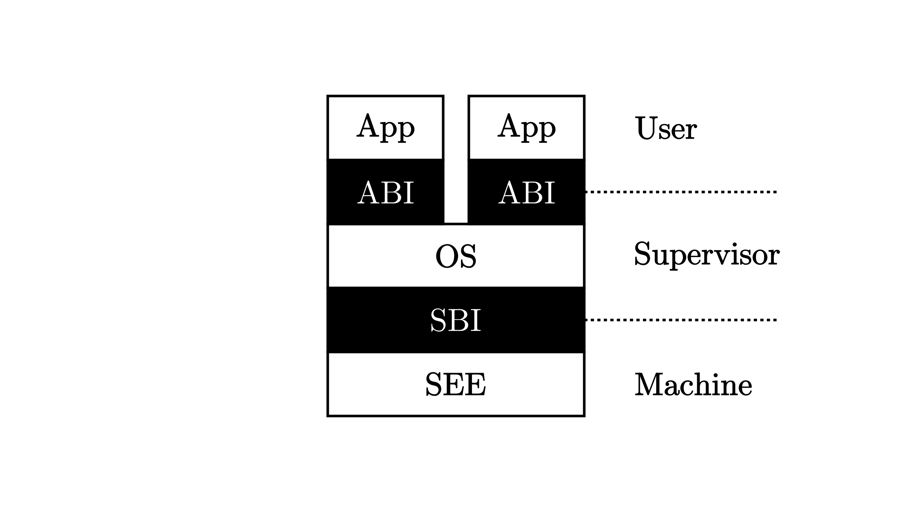

# Weekly 28

## 2022-07-11 Mon

### [rCore实验 第二章](https://learningos.github.io/rust-based-os-comp2022/chapter2/index.html)

#### 学习 [特权级机制](https://rcore-os.github.io/rCore-Tutorial-Book-v3/chapter2/1rv-privilege.html)

##### 特权级机制

实现特权级机制的根本原因: 应用程序运行的安全性不可充分信任.

对应用程序而言，需要限制的主要有两个方面:

- 应用程序不能访问任意的地址空间 (第四章)
- 应用程序不能执行某些可能破坏计算机系统的指令 (本章)

特权级机制需要软硬件协同设计。

具备特权级保护检查的新的机器指令:

- ecall: 具有用户态到内核态的执行环境切换能力的函数调用指令
- eret: 具有内核态到用户态的执行环境切换能力的函数返回指令

硬件具有了这样的机制后，还需要操作系统的配合才能最终完成对操作系统自身的保护。

RISC-V 特权级架构, 共定义了4种特权级. 除 M 外, 其他特权级均按需实现.

{width=100}

执行环境的另一种功能是对上层软件的执行进行监控管理. 常规控制流与 **异常控制流**.

RISC-V的特权指令相关:

与特权级无关的一般的指令和通用寄存器 x0 ~ x31 在任何特权级都可以执行。

如果处于低特权级状态的处理器执行了高特权级的指令，会产生非法指令错误的异常。在 RISC-V 中，会有两类属于高特权级 S 模式的特权指令：

- 指令本身属于高特权级的指令
- 指令访问了 S模式特权级下才能访问的寄存器 或内存

##### 实现应用程序

`asm!` 宏可以帮助我们更方便地和寄存器打交道, 实现内嵌汇编, 进而实现 ecall 调用的封装.

##### 实现批处理操作系统

##### 实现特权级的切换

在 RISC-V 架构中，关于 Trap 有一条重要的规则：在 Trap 前的特权级不会高于 Trap 后的特权级。

只要是 Trap 到 S 特权级，操作系统就会使用 S 特权级中与 Trap 相关的 控制状态寄存器 (CSR, Control and Status Register) 来辅助 Trap 处理。

其中, `sstatus` 是 S 特权级最重要的 CSR.

特权级切换的具体过程一部分由硬件直接完成，另一部分则需要由操作系统来实现。

- 当 CPU 执行完一条指令（如 ecall ）并准备从用户特权级 陷入（ Trap ）到 S 特权级的时候，**硬件** 会自动完成如下这些事情：......
- 而当 CPU 完成 Trap 处理准备返回的时候，需要通过一条 S 特权级的特权指令 sret 来完成，这一条指令具体完成以下功能：......

感觉和回调函数机制差不多~

用户栈与内核栈: 使用两个不同的栈主要是为了安全性. (这个是操作系统的一个设计, 并不是强制要求)

